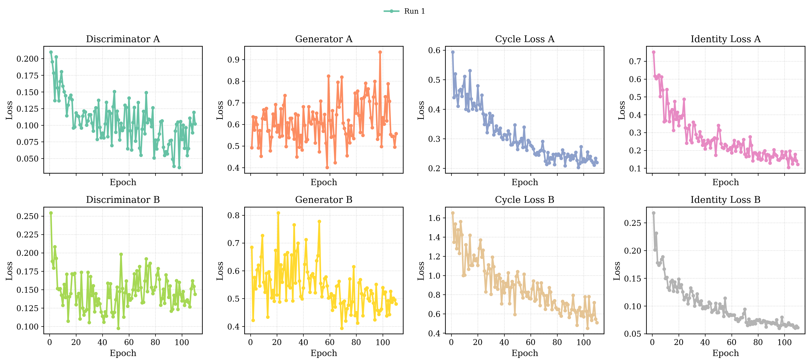
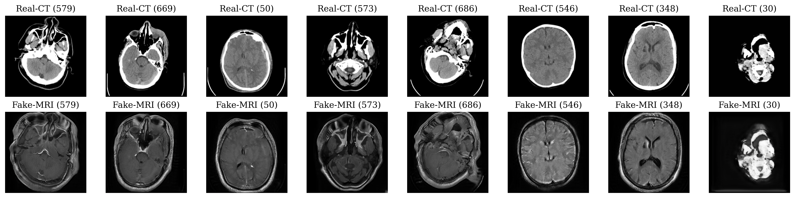
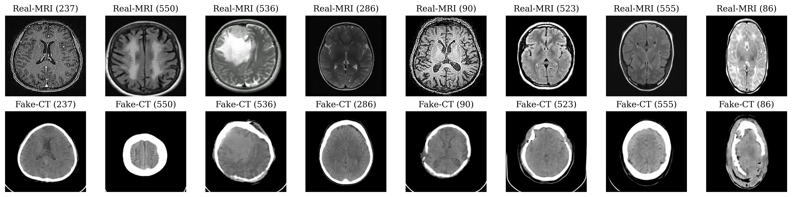
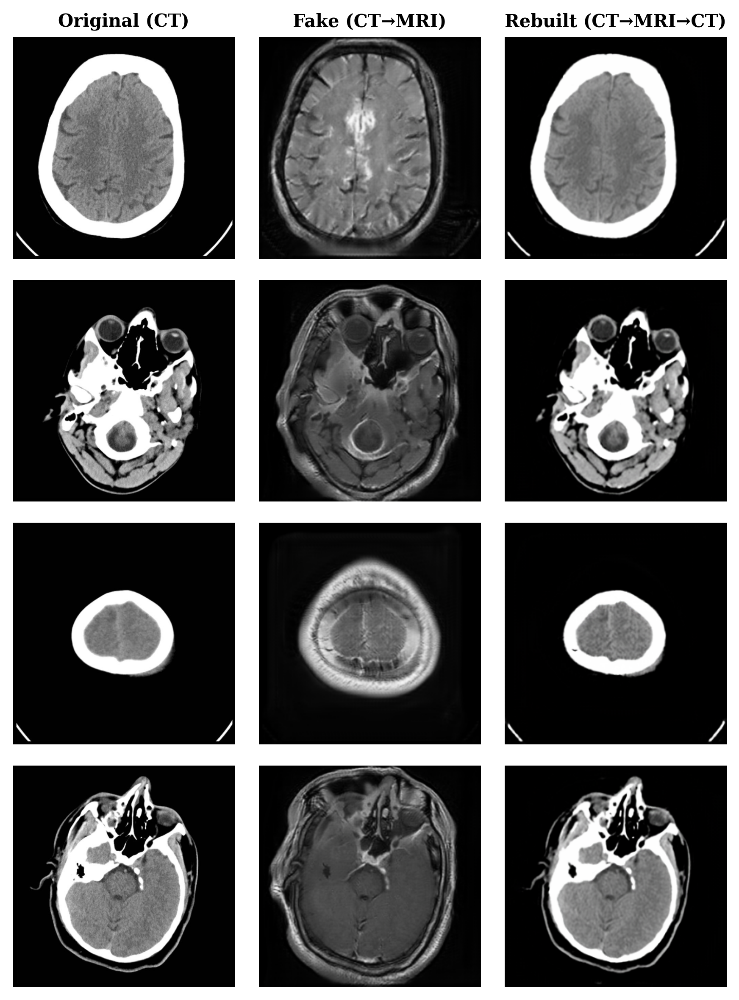
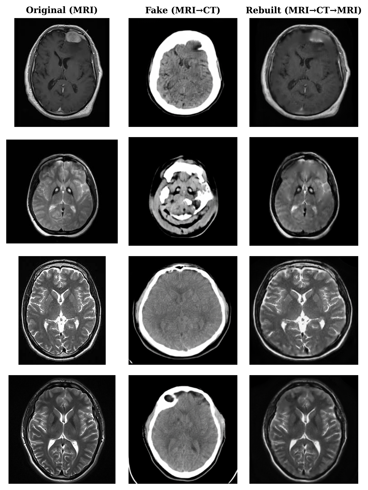

## Image-to-Image Translation with CycleGAN (PyTorch)

This repository provides a clean and practical implementation of **CycleGAN-based image-to-image translation**, built on top of the well-established [pytorch-CycleGAN-and-pix2pix](https://github.com/junyanz/pytorch-CycleGAN-and-pix2pix) codebase. Rather than re-implementing core architectures, the focus is on **reproducibility, clarity, and structured experimentation**, leveraging pretrained models and standardized datasets.

The workflow targets **unpaired image translation**, where corresponding image pairs across domains are not required. CycleGAN learns bidirectional mappings between two visual domains using cycle-consistency constraints, making it well suited for cross-domain medical imaging and visual style transfer tasks.

### 📦 Dataset Used

The experiments use the **Brain CT-to-MRI** dataset from Kaggle  
([CT-to-MRI CGAN Dataset](https://www.kaggle.com/datasets/darren2020/ct-to-mri-cgan)), which contains unpaired 2D brain images from two imaging modalities:

- **Domain A**: CT scans  
- **Domain B**: MRI scans  

This dataset is commonly used to study cross-modality image translation in medical imaging, where paired acquisitions are difficult or impossible to obtain. The goal is to learn a realistic mapping between CT and MRI appearances while preserving anatomical structure.

The dataset follows the standard CycleGAN directory structure:

- `trainA/`, `trainB/`: Unpaired training images from each modality  
- `testA/`, `testB/`: Unpaired test images for inference and evaluation  

This structure enables training and evaluation in both translation directions (CT → MRI and MRI → CT) using the same pipeline.

## 📊 Visualizing CycleGAN Training Losses from Log Files

Parses CycleGAN training logs (the CycleGAN was trained for **E=150** epochs) and visualizes the evolution of key loss components across epochs. The function uses regular expressions to extract discriminator, generator, cycle-consistency, and identity losses for both domains (A and B), supporting one or multiple training runs within the same log file.

The extracted data are aggregated per epoch and plotted, where each subplot corresponds to a specific loss term (e.g., Generator A, Cycle Loss B).  This visualization is useful for diagnosing convergence behavior, imbalance between generators and discriminators, and the effect of different training configurations.

  

Taking **CT input images** from the source modality and translate it to **fake MRI images** generated by the CycleGAN model:

  

Taking **MRI input images** from the source modality and translate it to **fake CT images** generated by the CycleGAN model:

  

Take **CT input** from the source modality and translate it to **fake MRI** generated by the CycleGAN model and rebuild the **CT** from the **fake MRI** again.

  

Take **MRI input** from the source modality and translate it to **fake CT** generated by the CycleGAN model and rebuild the **MRI** from the **fake CT** again.

  

---
# Horse ↔ Zebra and Van Gogh paintings ↔ Real photos

The workflow supports unpaired image translation tasks such as:
- **horse ↔ zebra**
- **Van Gogh paintings ↔ real photos**

Both datasets and pretrained weights are reused from the original implementation to ensure consistency with published results while enabling rapid experimentation, visualization, and extension.

### Available Resources
- **Datasets**: `horse2zebra`, `vangogh2photo`
- **Pretrained Models**: `horse2zebra`, `zebra2horse`, `style_vangogh`

This repository is intended as a lightweight, research-friendly setup for understanding CycleGAN behavior, running inference, and visualizing translation cycles (A → B → A) without modifying the underlying architecture.

### 📦 Datasets Used

The experiments rely on standard CycleGAN datasets commonly distributed with the original project:

- **`horse2zebra`**: Two unpaired domains containing horse images (domain A) and zebra images (domain B). The model learns to translate between these domains without requiring aligned pairs.
- **`vangogh2photo`**: Unpaired domains of Van Gogh-style artwork (domain A) and real-world photographs (domain B), used for artistic style transfer and domain translation.

Each dataset typically follows the folder structure:
`trainA/`, `trainB/`, `testA/`, and `testB/`, enabling training and evaluation for both translation directions.

### 🖼️ Visualizing Results from a Pretrained CycleGAN

Selects a random subset of test images and visualizes the output of pretrained CycleGAN models. For each sampled image, the original input (source domain) is shown alongside its translated counterpart produced by the generator. The examples include **horse → zebra** translations as well as **real images transformed into Van Gogh–style paintings**, enabling qualitative inspection of both object-level and artistic style transfer.

The inference pipeline configures dataset paths and runtime parameters and runs the `test.py` script in evaluation mode on the selected test split (`testA`). The pretrained generators are loaded without dropout, all test images are translated, and the results are saved using the standard CycleGAN output structure for consistent visualization and further analysis.

  

  

---
© Ashkan M., NTNU  
Released under the MIT License
---
